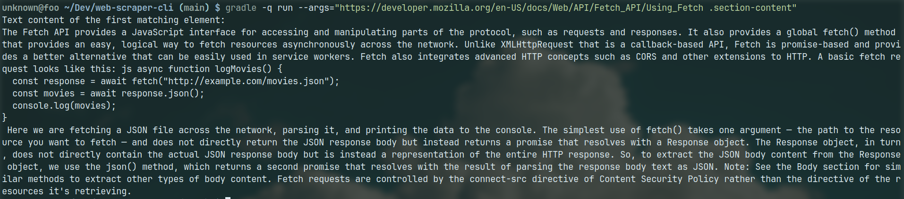

# web-scraper-cli

Little Java application I did for learning purposes. Got the idea from the "CLI
Apps" checkpoint on the [fullstack roadmap](https://roadmap.sh/full-stack)

## How to use

`gradle clean build` && `gradle -q run --args="<url> <.your-css-selector>"`

The "-q" parameter is optional, it makes gradle output less things on the
screen.

## Preview

## License

This project is licensed under the [MIT License](LICENSE).

---
